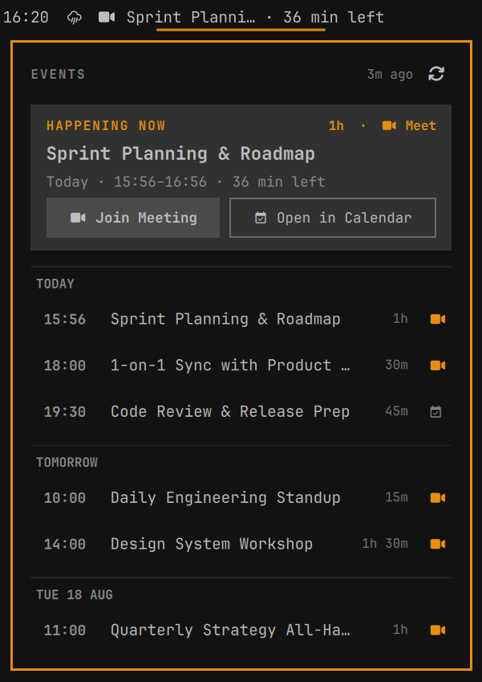
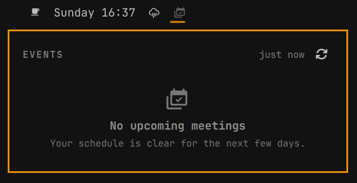

# event-widget

Native linux topbar event widget. Shows the next upcoming event from your calendars with live countdowns and lets you join Microsoft Teams calls with a single click.

<p align="center">
  
  <br>
  <em>Active meeting with live countdown in bar, hero card with Teams action, and multi-day agenda (shown in Matte Black theme)</em>
</p>

## Screenshots

| Empty Schedule State | Full Multi-Day Agenda |
| :---: | :---: |
| <br><sub><b>Zero-state</b> when your schedule is clear</sub> | <br><sub><b>Grouped agenda</b> across today, tomorrow, and future days</sub> |

## Features

- **Theme Aware**: Fully syncs with your active Omarchy theme (colors, typography, borders, and corner rounding adapt automatically)
- **Universal Calendar Support**: Works with standard `.ics` feeds from Microsoft Outlook, Todoist, Apple iCloud, Nextcloud, Proton, and custom URLs
- **Bar Widget**: Shows the next event with live countdown (`Daily in 15 min`, `Daily · 15 min left`, `Daily · 14:00`, `Daily · Tmrw 14:00`, `Daily · Wed 14:00`)
- **Quick Join**: Click to open the agenda panel; single click on "Join Meeting" opens Microsoft Teams links in the native Teams client
- **Calendar links**: Events with an iCalendar `URL` property can be opened from the agenda; no provider-specific calendar URL is assumed
- **Teams without links**: Outlook events that only contain a Microsoft Teams location are recognized and open the Teams Calendar page via `msteams:/l/calendar`
- **Instant Actions**: Right-click on the bar widget to join the next meeting immediately; middle-click to force-refresh
- **Repeating Events**: Automatically expands repeating events (daily standups, weekly meetings) and respects cancelled or rescheduled instances
- **Live Updates**: Automatic background sync every few minutes, with a 30-second reactive countdown timer

## Install

```sh
omarchy plugin add https://github.com/guilhermeris/event-widget.git --enable
```

Or manually: copy this folder into `~/.config/omarchy/plugins/guilhermeris.event-widget` and run

```sh
omarchy plugin enable guilhermeris.event-widget
```

## Remove

```sh
omarchy plugin remove guilhermeris.event-widget
```

## Supported Calendars

event-widget supports any standard **RFC 5545 iCalendar (`.ics`)** feed:
- **Microsoft Outlook / Office 365** (Published iCal URL)
- **Apple iCloud Calendar** (Shared calendar URL)
- **Nextcloud / Fastmail / Proton Calendar / CalDAV exports**
- **Custom / Local `.ics` URLs**

## Configure

Set your first calendar feed URL on the widget. An optional second feed can be
configured with `icsUrl2`:

```sh
omarchy bar set guilhermeris.event-widget icsUrl '<your-ics-feed-url>'
omarchy bar set guilhermeris.event-widget icsUrl2 '<your-second-ics-feed-url>'
```

Available settings (`omarchy bar set <widget> <key> <value>`):

| Key                   | Default | Description                                         |
| --------------------- | ------- | --------------------------------------------------- |
| `icsUrl`              | —       | First calendar iCal feed URL (required)              |
| `icsUrl2`             | `""`    | Optional second calendar iCal feed URL               |
| `refreshMinutes`      | `5`     | How often to refetch the feed                       |
| `showDaysAhead`       | `3`     | How many days ahead to list meetings                |
| `maxTitleLength`      | `28`    | Bar label truncation length                         |
| `showOnlyWithVideoLink` | `true` | Only show meetings that have a video link          |
| `browserCommand`      | `""`    | Command used to open meeting URLs (`xdg-open` by default) |

## Privacy

Calendar feeds are fetched directly by your machine. No external service, no
accounts, no telemetry.

## License

MIT
